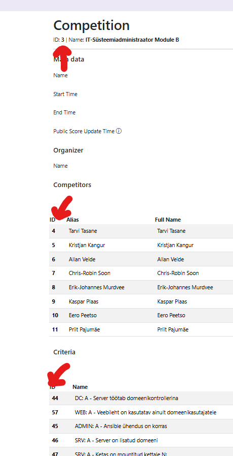

# Ansible Scoring
Author: Andreas Gabriel Vannas <andreasgabriel.vannas@gmail.com>
## Setup ansible
Current setup uses ssh key to connect.

### Files
And a vault file for secrets.
Add files:
  - `secrets/id_ed25519`
  - `secrets/vault`
> `secret/id_ed25519` is also used in the variable `ansible_ssh_common_args` under `group_vars/all.yaml`

### Variables
Set the api key which can add scoring history to [Arbitaja](https://github.com/WS-EE/Arbitaja)
```yaml
set_score_arbitaja_api_key: "Secret-arbitaja-api-key"
```

If you don't have Arbitaja. Then you can disable this function with the variable:
```yaml
set_score_want_arbitaja: false
```

### Creteria IDs used for NM25
Module A: 5-43;83
Module B: 44-82

## Roles under Scoring

There are in total 3 roles:
- score_module_a
- score_module_b
- set_score

### score_module_a

This is used to run auto tests on Linux machines.
It uses a `ansible.builtin.shell` to get an output which to evaluate against.
For evalutation `ansible.builtin.assert` is uesd.

If statement passes, full point will be given. If statement fails 0 point will be given.
If statement passes before and then fails the first result will be overwritten in arbitaja.

#### Variables
```yaml
# General variables
score_module_a_competition_id: 2

score_module_a_competitors:
  - name: Dummy Competitor
    id: 2
    proxy_host: 172.25.1.101
```
Here will be held all the competitors in a list of dictionaries.
And the competition id with the `proxy host` for ssh to use.
So the network traffic flowed like so: `Scorer_host` > `proxmox` > `competitor vm`
These will be used when `set_score` role is called inside this role.
```yaml
# Stage 1
score_module_a_test_stage_1:
  # ADMIN: A - ADMIN tööjaamas SSH võtmete põhine ligipääs
  - name: ADMIN tööjaamas SSH võtmete põhine ligipääs
    id: 5
    points: 1
    hostname: a_admin
    get_content:
      cmd1: |
        ssh -o StrictHostKeyChecking=no -o UserKnownHostsFile=/dev/null -o ConnectTimeout=5 \
        -o PreferredAuthentications=publickey -i /home/meister/.ssh/modulea meister@192.168.20.10 exit 0
    assert:
      - result1.rc == 0
```
You can create a list of dictonaries to evaluate the tasks.
`id` is the criteria id in arbitaja
`points` is the amount of points given by this criteria.
`hostname` is on which host to run it on from your inventory
`get_content` has to items under it `cmd1`(REQUIRED) and `cmd2`(OPTIONAL) which will write into `result1` and `result2`.
`assert` uses the `ansible.builtin.assert` module to evaluate the content of result1 or result2.

### score_module_b

This is used to run auto tests on Windows machines.
It uses a `ansible.builtin.win_shell` to get an output which to evaluate against.
For evalutation `ansible.builtin.assert` is uesd.

If statement passes, full point will be given. If statement fails 0 point will be given.
If statement passes before and then fails the first result will be overwritten in arbitaja.

#### Variables
Mostly the same as module_a variables

### set_score

The role `set_score` is used to write the output and assesment to local disk under `tests/`.
It also sets the score in Arbitaja.
This role on it's own is not very useful but when compined with `score_module_a` or `score_module_b` then it is very powerful.

#### Variables
```yaml
# Arbitaja variables
set_score_arbitaja_url: https://www.arbitaja.ee
set_score_arbitaja_api_key: arbitaja-api-key

# Scoring info forwarded
set_score_competition_id: 1
set_score_criteria_id: 30
set_score_criteria_name: "Tested criteria name"
set_score_competitor_id: 47
set_score_competitor_name: "Tested competitor name"
set_score_points: 2
set_score_evaluated_content: |
  Full criteria evaluated content
set_score_test: |
  Test done on the conetent

# Local user for local test tracking
set_score_local_user: user

# If arbitaja is not set up allow the disabling of score setting to arbitaja by setting this false
# Default is true
set_score_want_arbitaja: true
```

To set scores in arbitaja it uses the `set_score_competition_id`, `set_score_competitor_id`, `set_score_criteria_id` and `set_score_points`\
to set scores in arbitaja. These IDs can be found by the admin of arbitaja when editing the competition.



Variables `set_score_criteria_name` and `set_score_competitor_name` are used for local path making.
Variable `set_score_local_user` is what user owns the `tests/` path.
